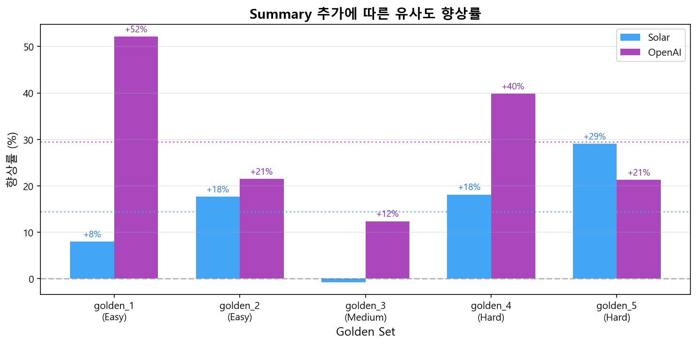

# 임베딩 v2 테스트 결과

> **제목 vs 제목+제안이유 비교 분석**
>
> 테스트 일시: 2026-01-16

---

## 1. 개요

### 실험 목적

**"산업통상자원부 입법 리스크 레이더"**가 Cross-Domain 법안을 얼마나 잘 감지하는지 측정하기 위한 임베딩 비교 테스트입니다.

| 버전 | 임베딩 대상 |
|------|------------|
| **v1** | 법안 제목만 |
| **v2** | 법안 제목 + 제안이유(summary) |

### 가설

> 제안이유(summary)를 포함하면, 제목만으로는 파악하기 어려운 **Cross-Domain 관련성**을 더 잘 감지할 수 있을 것이다.

---

## 2. 데이터

### Golden Set 구성

Cross-Domain 감지 테스트를 위해 선정된 5개 법안:

| ID | 난이도 | 법안명 | 소관위 | 리스크 요인 |
|----|--------|--------|--------|-------------|
| golden_1 | Easy | 탄소중립·녹색성장 기본법 | 기후위기 특별위원회 | 탄소 배출권, 공장 가동 규제 |
| golden_2 | Easy | 중대재해 처벌법 | 법제사법위원회 | 산업 현장 안전, 경영자 처벌 |
| golden_3 | Medium | 개인정보 보호법 | 정무위원회 | 자율주행/AI 데이터 규제 |
| golden_4 | Hard | 약사법 | 보건복지위원회 | 의약품 제조 설비 기준 강화 |
| golden_5 | Hard | 국유재산특례제한법 | 재정경제기획위원회 | 산업단지 세제 혜택 제한 |

**타겟 부처**: 산업통상자원부 (산업, 통상, 무역, 에너지 정책 담당)

---

## 3. 결과

### 3.1 모델별 유사도 비교

### 3.2 향상률 비교

### 3.3 상세 수치

| Golden ID | 난이도 | Solar v1 | Solar v2 | Solar 향상 | OpenAI v1 | OpenAI v2 | OpenAI 향상 |
|-----------|--------|----------|----------|-----------|-----------|-----------|------------|
| golden_1 | Easy | 0.4038 | 0.4360 | **+8.0%** | 0.2898 | 0.4409 | **+52.1%** |
| golden_2 | Easy | 0.3793 | 0.4463 | **+17.7%** | 0.3825 | 0.4646 | **+21.5%** |
| golden_3 | Medium | 0.3581 | 0.3555 | -0.7% | 0.3041 | 0.3417 | **+12.4%** |
| golden_4 | Hard | 0.3845 | 0.4542 | **+18.1%** | 0.3546 | 0.4960 | **+39.9%** |
| golden_5 | Hard | 0.3900 | 0.5035 | **+29.1%** | 0.4011 | 0.4866 | **+21.3%** |

### 3.4 난이도별 평균 향상률

| 구분 | Solar | OpenAI |
|------|-------|--------|
| **전체 평균** | +14.4% | +29.4% |
| Easy 평균 | +12.8% | +36.8% |
| Medium | -0.7% | +12.4% |
| **Hard 평균** | +23.6% | +30.6% |

---

## 4. 분석

### 핵심 발견

1. **Summary 추가 효과 확실** - 평균 14~29% 유사도 향상
2. **Hard 케이스에서 효과 극대화**
   - 약사법: OpenAI **+39.9%**
   - 국유재산특례제한법: Solar **+29.1%**
3. **OpenAI가 Summary 활용도 더 높음** - 29.4% vs 14.4%

### 법안별 해석

| 법안 | 해석 |
|------|------|
| **golden_1** (탄소중립 기본법) | "기후위기 취약계층", "근로자 건강장해" 등 산업 연관 키워드가 summary에 포함 |
| **golden_2** (중대재해 처벌법) | "사업장", "안전보건관리체계", "경영책임자" 등 산업 현장 관련 내용 |
| **golden_3** (개인정보 보호법) | 산업부와 직접 관련 적어 효과 미미 (정보통신 분야) |
| **golden_4** (약사법) | "의약품 제조", "공장 설비", "판매점" 등 제조·유통 관련 내용 |
| **golden_5** (국유재산특례제한법) | "신재생에너지", "에너지전환", "재생에너지 설비" 등 에너지 정책 키워드 |

---

## 5. 결론 및 제언

### 결론

> **제목+제안이유 임베딩 전략이 Cross-Domain 감지에 효과적**임을 확인했습니다.
> 특히 **Hard 케이스**(제목만으로 관련성 파악이 어려운 법안)에서 효과가 두드러집니다.

### 제언

| # | 제언 |
|---|------|
| 1 | **프로덕션 적용 시 v2(제목+Summary) 전략 채택** |
| 2 | **OpenAI text-embedding-3-small 권장** (비용 대비 효과 우수) |
| 3 | **임계값(threshold) 조정 필요** - v2 기준 0.45 이상이면 관련 법안으로 분류 권장 |

---

## 부록: 실험 환경

| 항목 | 내용 |
|------|------|
| 테스트 일시 | 2026-01-16 |
| 모델 1 | Solar Embedding (Upstage API) |
| 모델 2 | text-embedding-3-small (OpenAI API) |
| 타겟 R&R | 산업통상자원부 (822자, 증강 버전) |
| Golden Set | 5건 (제목 평균 20자, summary 평균 608자) |
